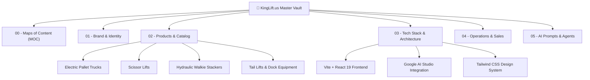

# 👑 KingLift.us — Brand & Engineering Knowledge Vault

Welcome to the central Obsidian Knowledge Vault for **KingLift.us**. This vault serves as the authoritative source of truth for product engineering specs, brand voice, web application architecture, and AI agent coordination.

---

## 🗺️ Maps of Content (MOCs)
- [[MOC-Products]] — Complete taxonomy of KingLift heavy machinery & material handling equipment.
- [[MOC-Architecture]] — Web platform layout, React state, Google GenAI assistant, and build pipelines.
- [[MOC-Brand]] — Visual language, industrial tone of voice, color codes, and copywriting rules.

---

## 🚀 Quick Navigation

### 1. Brand & Identity
- [[Brand-Voice]] — Tone, key messaging, and industrial value pillars.
- [[Design-System]] — Color palette (Charcoal, Safety Gold, Steel), typography, and button states.
- [[Value-Proposition]] — Why KingLift outperforms legacy forklift & lift equipment dealers.

### 2. Product Catalog
- [[KL-EP45Li-Electric-Pallet-Truck]] — 4,500 lbs Lithium-Ion Walkie Pallet Jack (Flagship).
- [[KL-EP60HD-Heavy-Duty-Pallet-Truck]] — 6,000 lbs Heavy Duty High-Capacity Pallet Truck.
- [[KL-SC19Li-Electric-Scissor-Lift]] — 19 ft Compact Lithium Electric Scissor Lift.
- [[KL-SC26HD-Rough-Terrain-Scissor-Lift]] — 26 ft Rough Terrain Industrial Scissor Lift.
- [[KL-ST33-Hydraulic-Walkie-Stacker]] — 3,300 lbs Electric Mast Walkie Stacker.
- [[KL-TL25-Commercial-Tail-Lift]] — 2,500 lbs Hydraulic Truck Tail Lift.
- [[KL-DL30-Hydraulic-Dock-Leveler]] — 30,000 lbs Warehouse Hydraulic Dock Leveler.
- [[KL-CR50-Industrial-Floor-Crane]] — 5,000 lbs Counterbalanced Mobile Shop Crane.

### 3. Technology & Web Application
- [[Vite-React-Architecture]] — Component hierarchy, folder tree, and Vite config.
- [[State-Management]] — Quote Cart drawer, filtering logic, and RFQ storage.
- [[Google-AI-Studio-Integration]] — Gemini API prompts for the AI Lift Advisor.
- [[Deployment-Guide]] — Vercel, Netlify, Firebase Hosting, and GitHub Pages deployment.

### 4. Operations & Sales
- [[RFQ-Fulfillment-Workflow]] — How quote requests and direct purchases flow.
- [[Warranty-And-Parts-Support]] — 3-year & 5-year powertrain warranty policies.
- [[Shipping-Freight-Estimates]] — LTL freight classes, liftgate delivery, and US warehouse hubs.

### 5. Multi-Agent AI System
- [[Prompt-Engineering-Templates]] — Prompts for ChatGPT, Claude, Antigravity, and Gemini.
- [[Agent-Handoff-Checklist]] — Step-by-step checklist when multiple coding models touch this repo.
